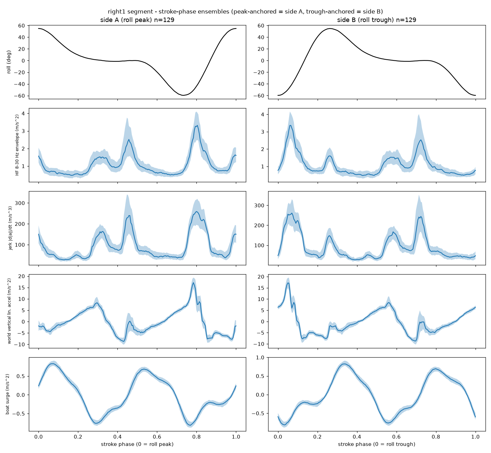
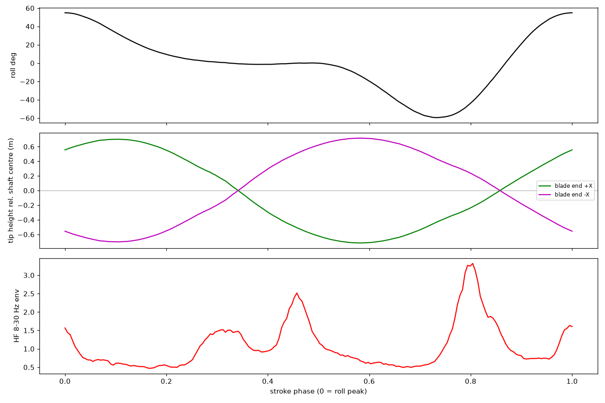
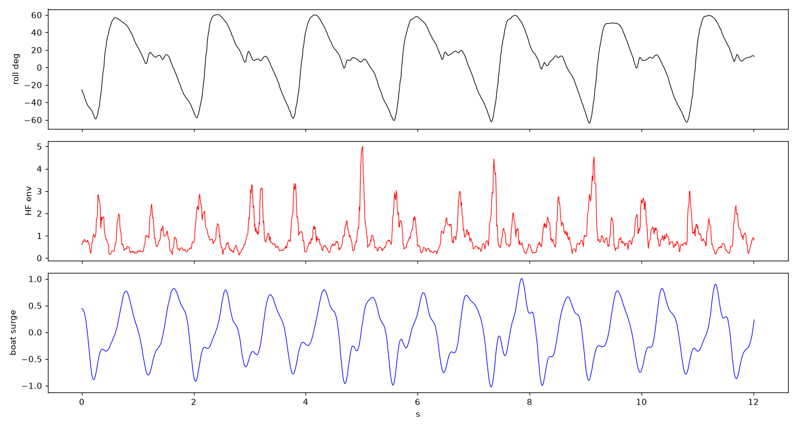
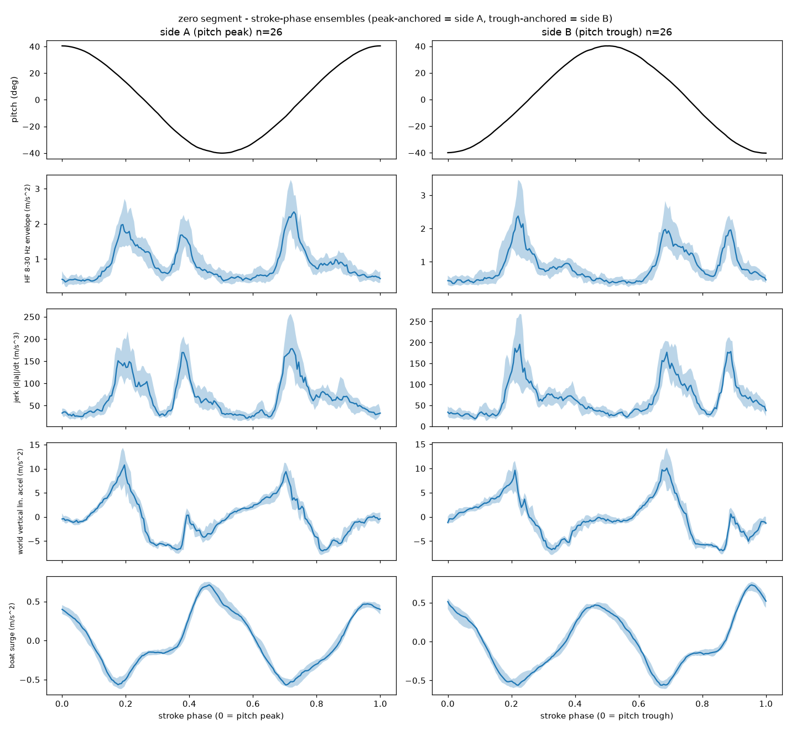

# How blade entry (catch) and exit (release) points are calculated

**PadViz7 `CatchEvents` engine + the Phase‑9 feasibility study — 21 Jul 2026**

---

## Scope and provenance

This note explains how the visualiser decides **when** each paddle blade enters
and leaves the water, and **where** (in the boat's frame) that happens. It embeds
the PNG images that sit next to it in `visualisation/`.

Those images were **not** produced for this note — they were generated earlier by
`visualisation/stroke_catch_explore.py` (the Phase‑9 feasibility study, first run
on the 16 Jul 2026 field data). They are included as the *evidence* the method is
sound; you can regenerate any of them yourself:

```bash
python visualisation/stroke_catch_explore.py <segment>
# <segment> is one of: right1  left  right2  zero   (default right1)
```

Two closely related things are described:

- **A. The feasibility study** (Python, `stroke_catch_explore.py`) — proves the
  physical signals exist and are repeatable. *This is what the images show.*
- **B. The live detector** (Processing, `PadViz7/CatchEvents.pde`) — the code that
  actually places the entry/exit dots in the left‑hand Entry/Exit panel during
  playback. Same physics, production‑friendly filters.

B is a faithful port of the method A validated, so they agree by construction.

---

## 1. The core idea — two independent questions

A stroke's catch/release is found by combining two things that come from
**different** sensor channels, so they cross‑check each other:

1. **Where is the blade?** → from **orientation** (the quaternion). The paddle
   shaft is the sensor's body **+X** axis. Rotating that axis into the world tells
   us which blade is low (near/under the water) and which is high (in the air). A
   blade is "in the water" for the run of frames where its tip sits below the
   shaft centre.
2. **When does it hit / leave the water?** → from the **accelerometer**. Water
   entry and exit are little impacts — a short burst of **8–30 Hz** vibration
   ("thud"), far above the slow ~0.5–1 Hz rocking of the stroke. The loudest burst
   in the *descending* part of an in‑water run is the **entry**; the loudest in
   the *rising* part is the **exit**.

Orientation gives the coarse window and which blade; the high‑frequency impact
envelope gives the sharp timestamp inside that window.



*Figure 1 — `catch_ensemble.png` (right1 segment). Every cycle is time‑normalised
to a 0→1 phase and averaged. Row 2 (HF 8–30 Hz envelope) shows **four sharp bumps
per full cycle = 2 entries + 2 exits** (right in, right out, left in, left out).
That the same four bumps line up with tip‑height crossings and boat surge is the
proof they are real catch/release impacts.*

---

## 2. Per‑frame signals (`CatchEvents.pde`, `compute()`)

For every frame *i*:

- **`amag[i] = |accel| = √(ax²+ay²+az²)`** — accelerometer magnitude.
  Orientation‑independent, so the impact "thud" survives however the paddle is
  held.
- **Shaft direction in the world** = first column of the rotation matrix `R(q)`:
  ```
  ux = 1 - 2(qy² + qz²)
  uy = 2(qx·qy + qw·qz)
  uz = 2(qx·qz - qw·qy)
  ```
  From this:
  - `uzRaw[i] = uz` — vertical component of the shaft. `+X` tip height above the
    shaft centre = `+uz·1.05 m`; `−X` tip height = `−uz·1.05 m`.
  - `phi[i] = atan2(uy, ux)` — compass heading of the shaft in the world.
  - `hMag[i] = √(ux²+uy²)` — how much of the shaft lies in the horizontal plane
    (scales the blade's XY reach).
- **Which quaternion?** GRV (Game Rotation Vector, magnetometer‑free) when the CSV
  has it (v8.13+), because the fused yaw carries a cycle‑periodic magnetic
  artefact that GRV does not (firmware spec §16.11). Older files fall back to the
  fused quaternion (status line says "approx").
- **Impact envelope:** `hf = bandpass(amag, 8..30 Hz)` (2nd‑order Butterworth,
  applied forward *then* backward for zero phase → no timing skew), then
  `env = 50 ms RMS of hf` → the smooth "loudness of impact" curve. Its peaks are
  the events.
- **Tip‑height driver:** `uzLp = lowpass(uzRaw, 3 Hz, zero‑phase)` — de‑noised
  blade up/down signal used to find in‑water runs.

---

## 3. Finding an in‑water run, then splitting it into entry + exit

For each blade (right `+X` then left `−X`; `sgn = +1 / −1`):

A frame is **in water** when the tip is below the centre by more than `LOW_T`:

```
sgn · uzLp[i] · BLADE_L  <  LOW_T          (LOW_T = -0.05 m, BLADE_L = 1.05 m)
```

Consecutive in‑water frames form a **run** `[runStart … runEnd]`, kept only if its
length is between `MIN_RUN_S = 0.20 s` (shortest credible immersion) and
`MAX_RUN_S = 4.0 s` (longer ⇒ the boat is at rest, not a stroke).

Inside a kept run, `minIdx` is the deepest‑tip frame. That splits the run into:

- **descending** `[runStart … minIdx]` → contains the **entry**
- **rising** `[minIdx … runEnd]` → contains the **exit**

The event time in each part is the frame with the **loudest** impact envelope,
accepted only if it clears the impact gate:

```
best = argmax(env) over that part
accept if env[best] ≥ envGate,  envGate = max(ENV_RATIO · median(env), ENV_FLOOR)
                                (ENV_RATIO = 1.3, ENV_FLOOR = 0.8 m/s²)
```

i.e. the burst must be at least 1.3× the typical background **and** above an
absolute floor. A gentle dip with no real impact produces no event.

**This is the whole entry/exit decision.** Everything else is placing the point in
space.



*Figure 2 — `tip_height.png` (right1). Middle panel: tip height of both blade ends
(`+X` green, `−X` magenta) vs stroke phase; where a curve dips below 0 the blade is
under the shaft centre (the in‑water window). Bottom: the HF impact envelope. The
bumps line up with the **start (entry)** and **end (exit)** of each dip — section 1's
two‑question logic, drawn.*

---

## 4. Where the event is drawn (boat‑frame XY)

Each accepted event becomes a position in the **boat frame** (`+X` = starboard,
`+Y` = bow) for the top‑down Entry/Exit scatter:

```
a  = phi[best] - psiRef[best] - datumEff        (shaft heading relative to the
                                                 boat, minus the datum)
r  = BLADE_L · hMag[best] · sgn                  (horizontal reach of the blade)
xB = r · cos(a)
yB = r · sin(a) + PADDLE_BOW_OFFSET_M            (+0.45 m: the shaft centre sits
                                                 forward of the boat's centre)
```

- **`psiRef`** = the boat's heading at the synced frame (boat GRV yaw preferred;
  with no boat CSV, a ±15 s rolling circular mean of the shaft heading is used
  instead — flagged "approx").
- **`datumEff`** = yaw datum = the constant rotation that makes "shaft `+X`" read
  as "boat `+X` (starboard)" at rest. It is the circular mean of `(phi − psiRef)`
  over the sidecar rest window (or the whole file if there is no sidecar), **plus**
  any manual nudge (`Sidecar.yawManualAdjustDeg`, the `n`/`N` keys). The manual
  override exists because the automatic datum was tens of degrees off on some
  sessions (spec §13.7).
- **Side / colour:** sensor `+X` = shaft toward the **right** blade (spec §2), so
  `+X` events are the right blade, `−X` the left. If a session's paddle was mounted
  reversed the colours swap — a physical mount fact, not a software correction (see
  memory `project_paddle_mount_diagnosis`).

---

## 5. The images in this folder

All produced by `stroke_catch_explore.py` on `PadLog20260716.csv` /
`BoatLog20260716.csv`. The filename **suffix** is the data segment:

| suffix | segment |
|---|---|
| *(none)* | `right1` — first steady right‑handed stretch |
| `_left` | left‑handed stretch |
| `_right2` | second right‑handed stretch |
| `_zero` | **zero‑feather** stretch (anchored on **pitch**, not roll, because roll is half‑period ambiguous at zero feather — spec §16.10) |

### `catch_ensemble*` — the key evidence
Shown as Figure 1. Layout is 5 rows × 2 columns: left column = "side A" (cycles
anchored on the roll/pitch **peak**), right = "side B" (anchored on the
**trough**). Rows: 1 anchor angle · 2 **HF 8–30 Hz impact envelope** (the
entry/exit signal) · 3 jerk · 4 world‑frame vertical accel · 5 boat surge (synced
via `rx_ms`). Look for four bumps per cycle in row 2.

### `catch_strip*` — raw sanity check
A raw, un‑averaged 12‑second slice: roll (top), HF impact envelope (middle), boat
surge (bottom). Confirms the neat averaged bumps correspond to genuine per‑stroke
events in the raw data.



*Figure 3 — `catch_strip.png` (right1).*

### `tip_height*` — geometry ↔ impact alignment
Shown as Figure 2. Top: anchor angle. Middle: both blade‑end heights vs phase.
Bottom: HF envelope. The HF bumps line up with the in‑water dips.

### Zero‑feather segment
Detection is unchanged; only the cycle **anchoring** switches to pitch.



*Figure 4 — `catch_ensemble_zero.png`. The zero‑feather stretch, anchored on pitch.
The HF impact structure (row 2) is still present per cycle even though the roll
waveform is symmetric.*

> Reported timing sharpness (printed by the script, right1 segment): the HF bumps
> are phase‑locked with a per‑cycle jitter of roughly **±33 to ±96 ms** — tight
> enough to timestamp a catch to a fraction of a stroke.

### Not about entry/exit — don't be misled
- **`stroke_compare.png`** — padnormal vs padbad **roll** waveforms/spectra, from
  the 11 Jul two‑piece‑paddle CPM over‑count investigation (`stroke_compare.py`).
  Nothing to do with catch/release.
- **`stroke_hifreq.png`** — high‑frequency **roll** content for that same CPM bug
  (`stroke_hifreq.py`). Also unrelated to entry/exit.

They live in the folder because they came from a different study; listed here only
so you know they are not part of this explanation.

---

## 6. Feasibility script vs live detector — the small differences

Same physics, different mechanics chosen to suit each environment:

| | Feasibility study (`stroke_catch_explore.py`) | Live detector (`CatchEvents.pde`) |
|---|---|---|
| Impact band‑pass | brick‑wall FFT band‑pass (offline) | 2nd‑order Butterworth, forward+backward (zero phase) |
| Cycle handling | segments by roll/pitch peaks, ensemble‑averages to **show** structure | detects each in‑water run directly; timestamps a single event so dots appear live |
| Heading / datum | fixed per‑segment, exploratory | per‑file/per‑sidecar datum + saved manual nudge |

The images explain and justify the method; `CatchEvents.pde` is the production
implementation of it.

---

## 7. Known limits / things that can look wrong

- **Yaw‑datum error:** if the automatic datum is off, **all** entry/exit dots
  rotate together about the origin. Fix with the `n`/`N` nudge keys (saved in the
  sidecar). A calibration, not a detection bug.
- **No boat CSV:** heading falls back to a rolling mean of the paddle's own
  heading — fine for "which side / how far out", weaker for absolute bearing.
- **Pre‑GRV files (older than v8.13):** fused yaw is used and the status line says
  "approx"; expect a little more scatter from the magnetic artefact.
- **Zero feather:** detection works, but cycle anchoring uses **pitch**, not roll
  (roll is half‑period ambiguous) — hence the `_zero` images anchor on pitch. The
  entry/exit logic itself (tip height + HF impact) is unchanged.
- **Very gentle strokes** with no real splash may not clear `envGate` and so
  produce no event — by design, to avoid false positives.

---

**Code:** `visualisation/PadViz7/CatchEvents.pde` (live detector),
`visualisation/stroke_catch_explore.py` (feasibility study + images).
**Spec:** `visualisation/specs/padviz6_spec.md` §13.3 (engine), §13.5
(feasibility), §13.7 (yaw datum override); firmware spec §16.11 (GRV vs fused
yaw).
